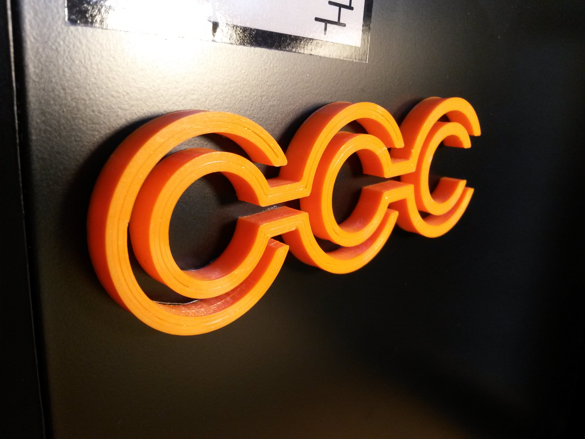

A 3D Model of the infamous CCC logo, which was created by hacking the logo of Hamburg Congress Center.

You customise the model by editing [main.jscad](main.jscad), or just use the [stl file](cch-ccc.stl). 

*Second photo: CC BY 2.0 by [Flickr user Astro](https://www.flickr.com/photos/127035051@N06/)*